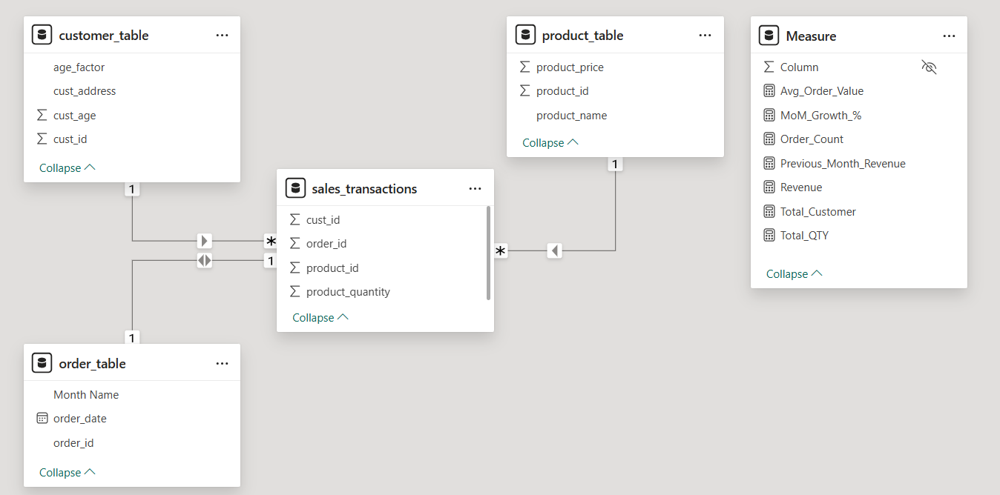
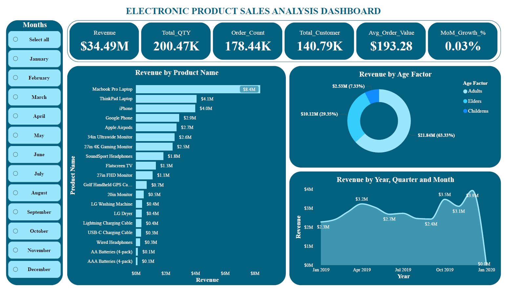

# 💡 Power Bi Project by Yash Yennewar

# Electronic_Product_Sales_Analysis_Project
A Power BI dashboard analyzing electronic product sales performance with interactive KPIs, customer insights, and trend analysis.

## 🔗 Project Link :

[Electronic_Product_Sales_Analysis](Electronic_Product_Sales_Analysis.pbix)

---

## 📁 Project Overview
This Power BI project provides an in-depth **sales performance analysis** of electronic products.  
It visualizes revenue trends, customer behavior, and key performance metrics to help stakeholders make data-driven business decisions.

---

## 🎯 Objectives
- Track and monitor **total revenue**, **quantity sold**, and **order volume**.  
- Identify **top-performing products** and **customer demographics** driving sales.  
- Analyze **monthly and yearly revenue growth trends**.  
- Measure **average order value** and **customer acquisition performance**.

---

## 📸 Data Model Screenshot : 


---

## 📈 Key Performance Indicators (KPIs)
| KPI Name | Description |
|-----------|-------------|
| **Total Revenue ($34.49M)** | Total sales revenue generated from all product categories. |
| **Total Quantity (200.47K)** | Total number of electronic items sold. |
| **Order Count (178.44K)** | Number of completed transactions. |
| **Total Customers (140.79K)** | Unique customers who placed orders. |
| **Average Order Value ($193.28)** | Average revenue per customer order. |
| **Month-over-Month Growth (0.03%)** | Month-over-month growth rate in total revenue. |

---

## 📊 Visualizations Used
1. **Revenue by Product Name** – Bar chart showing top-selling products (e.g., MacBook Pro, ThinkPad, iPhone).  
2. **Revenue by Age Factor** – Donut chart categorizing revenue by customer age group (Adults, Elders, Children).  
3. **Revenue Trend by Year, Quarter, and Month** – Line chart tracking sales trends over time.  
4. **Monthly Filter Panel** – Slicer allowing dynamic month-wise filtering.  

---

## 🧮 DAX Measures Used
Here are some of the key **DAX calculations** that power this dashboard:
```
DAX
-- Total Revenue
Revenue = SUMX(sales_transactions,sales_transactions[product_quantity] * RELATED(product_table[ product_price ]))

-- Total Quantity
Total_QTY = SUM(sales_transactions[product_quantity])

-- Order Count
Order_Count = DISTINCTCOUNT(sales_transactions[order_id])

-- Total Customers
Total_Customer = DISTINCTCOUNT(sales_transactions[cust_id])

-- Average Order Value
Avg_Order_Value = DIVIDE([Revenue],[Order_Count],0)

-- Month-over-Month Growth %
MoM_Growth_% = CALCULATE(DIVIDE([Revenue] - [Previous_Month_Revenue],[Previous_Month_Revenue]),ALL(sales_transactions))
```

---

## 📸 Dashboard Screenshot : 


---

## 🧠 Insights Derived
- **MacBook Pro Laptops** and **ThinkPad Laptops** contribute the highest revenue.  
- **Adults** are the primary buyers, generating over **60% of total sales**.  
- A consistent **upward sales trend** is observed toward the end of **2019**.  
- **Average order value** remains steady around **$190–$200**, indicating balanced pricing and demand.  

---

## 🛠️ Tools & Technologies
- **Power BI Desktop**  
- **DAX (Data Analysis Expressions)**  
- **Excel / CSV Dataset**  
- **Data Modeling (Star Schema)**  
- **Data Transformation using Power Query**  

---

## 📌 Future Enhancements
- Add **profit margin and cost analysis** KPIs.  
- Integrate **geographical analysis** using map visuals.  
- Include **customer segmentation** based on purchase frequency.  
- Automate **dataset refresh** using Power BI Service.

---
